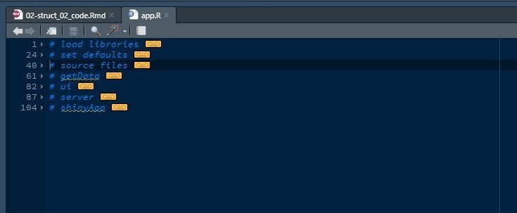

# Code Structure {#code}

Once you have arranged the files and folders in a logical way then comes the fact that the code itself should be arranged in such a way that it feels easy to go through. Always remember **Code is read more often then it's written**. Your world should revolve around this line. If you delegate your work while leaving your firm to someone else than the person who is handling your code should be able to understand everything you were trying to do. You will be in that position someday and you would wish your colleagues must have done the same. Even if you aren't sharing your code to somebody one day when you will return back to the project after say 7 to 8 months you will be surprised to see the mess you created back then. With this in mind hope this will help you in your journey.

## Create Sections

Rstudio gives you an ability to create section by pressing ( ctrl + shift + R ), or you can create one

by adding 4 dashes (-) after a comment or 4 hash symbol (\#) after a comment.

    # some comment ----
    # some comment ####

Both are valid syntax. you can name your section in the comment. Same rule applies for the Rmarkdown documents as well you should always name your code chunk.

    # ```{r chunkname, cache=TRUE}

It also helps you jump between sections (Shift+Alt+J). You can easily switch between sections and fold them at will. It helps you not only in navigation but keeping a layout of the entire code as well.

A 800+ line files will look something like this.


It makes your code beautiful to look and makes it maintainable in long run.

## Order of Code

When you write code there are standard practices that are used across the domain and you should definitely use them. These are simple rules that most beginners aren't concerned about but the more experience you gain the more you start to realize the latent power of code organization. Here are a simple tip you should use.

1.  Call your libraries on top of code
2.  Set all default variables or global options and all the path variables at the top of the code.
3.  Source all the code at the beginning
4.  Call all the data-files at the top

In this exact order. This coherence keeps all your code easy to find. Most annoying thing in debugging someone else code is finding path variables laid out inside functions. Please don't ever do that. That is not a good practices. Take a look at one of my file



If you think you will forget it. There is a golden rule you must remember. ***Put all the external dependencies on top of your code***. Everything that I mentioned above is external to the code in the file. In exact order.

1.  Libraries are external to the file.
2.  path variables
3.  other files apart from one you are working is external as well.
4.  databases and CSV

Just by doing this you will be able to navigate better in your code. There aren't any hard and fast rules for this only logical and sensible ones. Feel free to come up with your own layout that helps you in your analysis journey.

## Indentation

It goes without saying that indentation makes your code readable. Python is not the only language who has the luxury of indentation. No matter what language you work in your code should be properly indented so that we can understand the nature of code written. There are a few things you can understand about indentation.

Maintain same number of spaces throughout your code. Your editor will help you out with it for sure but even if you are working on multiple editors. If you choose 2 spaces or 4 spaces as an equivalent of tabs you should stick to it. This is a golden rule you should never break.

Then maintain the same style in your code. Look at the code below.

```{r}

foo <- function(
  first_arg, second_arg, third_arg
){
  create_file <- readxl::read_excel(path = first_arg, sheet = second_arg, 
                                    range = third_arg)
}

bar <- function(
  first_arg,
  second_arg,
  third_arg
){
  create_file <- readxl::read_excel(
    path = first_arg, 
    sheet = second_arg, 
    range = third_arg
    )
}
```

function foo is written horizontal and bar is written vertical. I would prefer styling of function bar but you may choose one and stick to it for entire project. Mixing styles is not considered good and might create problem in code review.

There is a package by name `grkstyle` which implements vertical arrangement of code as mentioned above. You can look into it as well.

## Conclusion'

In this chapter we discussed how to structure your code to make it more meaningful to read and easier to debug. The key takeaways from this chapter is:

1.  Create sections to write beautiful and navigable code
2.  Put those sections in a logical order
3.  Don't
