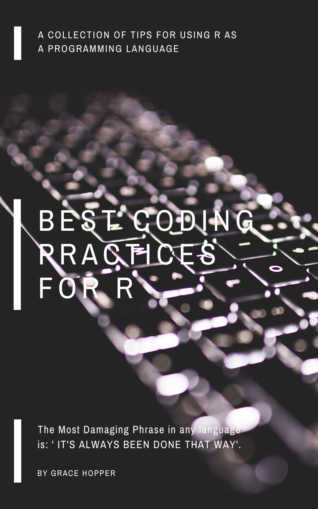

--- 
title: "Best Coding Practices for R"
author: "Vikram Singh Rawat"
date: "`r Sys.Date()`"
site: bookdown::bookdown_site
documentclass: book
bibliography: [book.bib, packages.bib]
biblio-style: apalike
link-citations: yes
description: "This book explains the most important things you need to know while you are writing production level R code."

---

# (PART) Introduction {-}


```{r setup}

knitr::opts_chunk$set(include = TRUE)

library(magrittr)
library(quanteda)
library(dplyr)

klippy::klippy()
```

# CoverPage {-}

> Know the rules well, so you can break them effectively. 
> --- The Dalai Lama

<br/>

***


